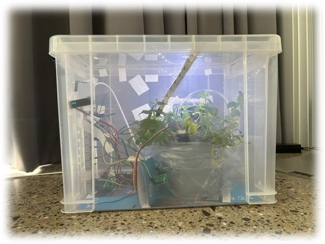
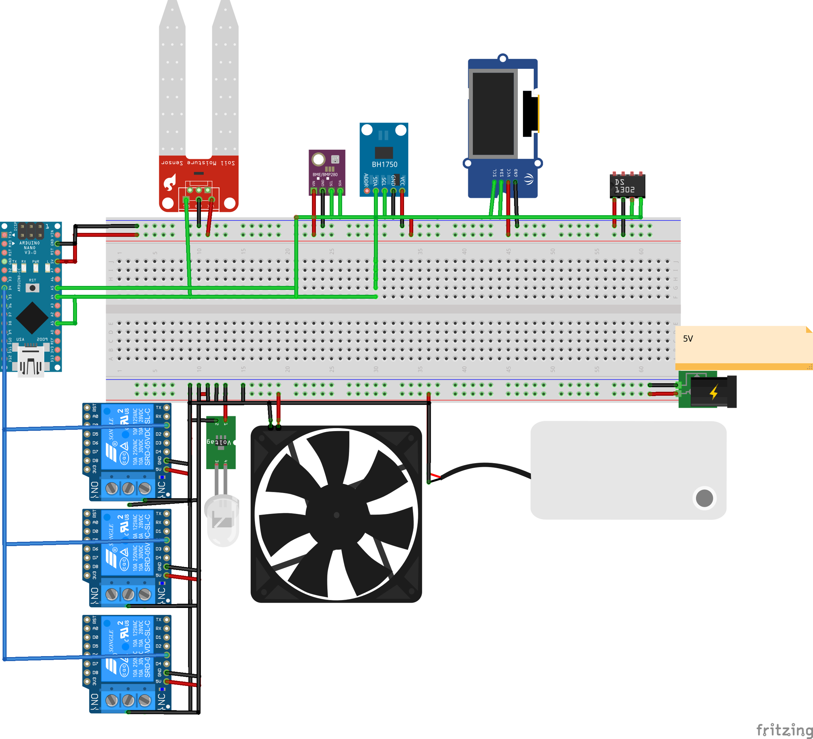
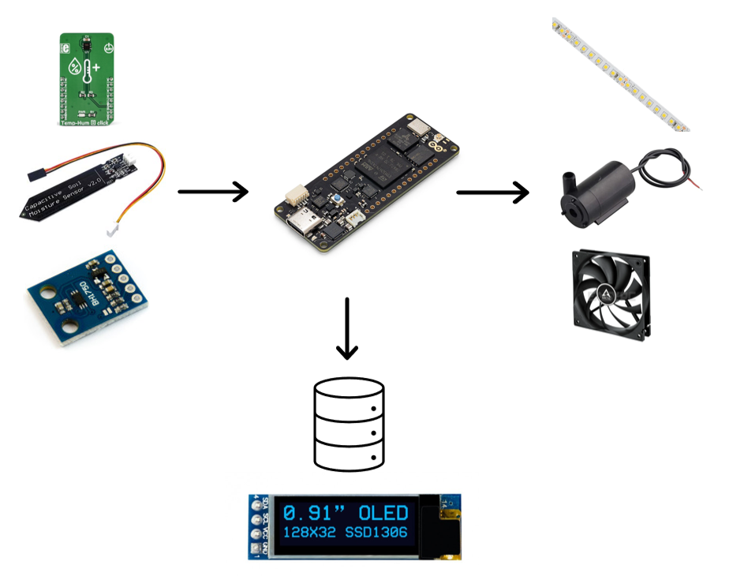
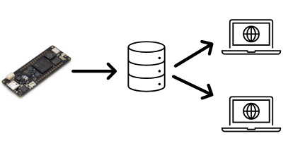

# Automatic Greenhouse
Schweizer Jugend Forscht - Coding Camp   
Advised by Alberto Ferrante - USI Departement CS   
   
The goal for this project week was to make a fully functioning automated greenhouse, where all funtions that would need manual work, would be able to be done by the greenhouse. The main code is in /multithreading.



## Hardware
- 1x Arduino Nano 33 Sense BLE
- 1x Capacitive Soil Moisture Sensor v1.2
- 1x Voltage Converter (5V-->12V)
- 1x LED Strip
- 3x Relay
- 1x RTC
- 1x Pump
- 1x Fan
- 1x 5V PSU
- 1x Laptop or other device to run server backend for the webapp



## Todo
- [x] Light detection
- [x] Automatic Watering
- [x] Soil Humidity Sensor
- [x] RTC Module
- [x] Detection Water Supply (empty or not)
- [x] Temperature Sensor/Fan
- [x] Multithreading
- [x] Air Humidity
- [x] Build Greenhouse
- [x] Display
- [x] WebApp
- [x] Poster (Fritzing)
- [ ] Report



## Work journal

#### Decided on materials needed:
  - Arduino Nano 33 Sense BLE (contains various sensors)
  - Soil Moisture Sensor - to detect water level in soil
  - LED light strips - to supply plant with needed light
  - Water pump - to supply plant with water
  - Voltage Regulator - water pump needs more voltage than what the Nano can supply
  - Relais - works like a light switch

#### Calibrate humidity sensor
1. Figure out the output value in completely dry environment (here: $363$)
2. Figure out the output value while submerged in water (here: $699$)

These values correspond to 0% humidity and 100% humidity:
   Create a linear function that maps these values:
   $f(x) = mx + b = -0.29761x + 208.0357$

#### Relay
A relay is like a remote control switch that lets a small electrical signal turn a bigger device on or off. It allows you to control things like motors or lights using just a small amount of power, keeping the control system safe and separate from the high power used by the device. We use it to power our water pump and the LED strips.

#### Voltage Regulator
With a voltage regulator, we can convert an input voltage of 3.3 V into 12 V. We use it to power the LED strips, as they need 12 V to function.

#### Humidity Logic

- Check moisture level
- If moisture level below threshold, pump water
- Check again once level is stable


 

```c++
  float averageSoilHumidity = get_average_soil_humidity();

  // Check if moisture is below threshold
  if (averageSoilHumidity < SOIL_MOISTURE_THRESHOLD) {
    int currentTime = millis();

    while (averageSoilHumidity < SOIL_MOISTURE_THRESHOLD) {

      onLowSoilMoisture();

      do {
        for (int i = 0; i < HUMIDITY_MOISTURE_AVERAGE_ELEMENTS; i++) {
          averageSoilHumidity = get_average_soil_humidity();
          addElement(differenceAverageSoilHumidity, averageSoilHumidity);
          delay(DELAY_TIME_STABILIZING_ARRAY);
        }
      } while (!is_stabilizing(differenceAverageSoilHumidity));
    }

    endTime = millis() - currentTime;
  }

  if (HOUR > endTime) {
    delay(HOUR - endTime);
  } else {
    delay(0);
  }
  endTime = 0;
```
---

#### LED Logic
- Initializes color sensor and RTC.
- Calculates hourly average of  brightness, updates 24-hour history.
- Tracks hours with brightness above threshold.
- If light hours < required and remaining daylight insufficient, turns on LED.
  
```c++
    if (Colour.pop(colourData)) {
        float brightness = calculateBrightness(colourData.r, colourData.g, colourData.b);
        hourlyBrightnessAccumulator += brightness;
        brightnessReadingsCount++;

        if (brightnessReadingsCount >= (HOUR_DURATION / 1000)) {  // Assuming one reading per second
            float averageBrightnessForHour = hourlyBrightnessAccumulator / brightnessReadingsCount;

            for (int i = 1; i < 24; i++) {
                brightnessHistory[i - 1] = brightnessHistory[i];
            }
            brightnessHistory[23] = averageBrightnessForHour;

            hourlyBrightnessAccumulator = 0;
            brightnessReadingsCount = 0;

            hoursWithLight = 0;
            for (int i = 0; i < 24; i++) {
                if (brightnessHistory[i] > THRESHOLD_PERCENTAGE) {
                    hoursWithLight++;
                }
            }

            int remainingHours = 24 - rtc.hour;

            if (hoursWithLight < LIGHT_THRESHOLD_HOURS) {
                int requiredLightHours = LIGHT_THRESHOLD_HOURS - hoursWithLight;
                if (remainingHours <= requiredLightHours) {
                    digitalWrite(LED_PIN, LOW);  // Turn on light
                } else {
                    digitalWrite(LED_PIN, HIGH);  // Turn off light
                }
            } else {
                digitalWrite(LED_PIN, HIGH);  // Turn off light if enough light
            }
        }

        delay(1000);  // Delay for 1 second for each sensor reading
    }
```
---

#### Temperature Logic

- Check temperature every half hour
- If it exceeds the threshold turn the fan on
- Fan can only turn off if the temperature is below the threshold minus a buffer, so that the fan isn't constantly turning on and off

```c++
  float temperature = HTS.readTemperature()

  if (temperature > TEMPERATURE_THRESHOLD) {
    digitalWrite(FAN_PIN, LOW);
  } else if (temperature < TEMPERATURE_THRESHOLD - BUFFER) {
    digitalWrite(FAN_PIN, HIGH);
  }
  delay(1800000);
```
---

#### Display Logic

- Scrolling text display (horizontal)
- Get information from each thread (global variables)
- Ensure that full text gets scrolled before reset
- Notify user when water tank is empty

```c++
  String line2_start = "Light status: ";
  if (isGettingLight) {

    line2_start = "Light status: lit";
  } else {

    line2_start = "Light status: dark times";
  }

  int charWidth = 6;                                    // Adjust this depending on your font size
  int maxChars = display.width() / charWidth;           // Calculate how many characters fit on the display
  int paddingSpaces = maxChars - line2_start.length();  // Calculate how many spaces you need

  // Create a string with the right amount of padding
  String paddedString;
  for (int i = 0; i < paddingSpaces; i++) {
    paddedString += " ";
  }

  if (paddedString == "") {
    paddedString = "  ";
  }


  String line2_end = "Hours of Light: " + String(hoursWithLight);
  String line2 = line2_start + paddedString + line2_end;

  min_x_coord_display = -6 * line2.length();

  display.clearDisplay();
  display.setCursor(x_coord_display, 10);
  display.print(line2);
  display.display();

  String line3 = "Pump status: ";

  if (lowWater) {
    line3 = "NO WATER IN TANK! REFILL!";
  } else {
    line3 = "";
  }


  display.setCursor(x_coord_display, 20);
  display.print(line3);
  display.display();


  String line1_start = "Humidity " + String(averageSoilHumidity) + "%";


  paddingSpaces = maxChars - line1_start.length();  // Calculate how many spaces you need

  // Create a string with the right amount of padding
  paddedString = "";
  for (int i = 0; i < paddingSpaces; i++) {
    paddedString += " ";
  }


  String line1_end = String(temperature) + "°C";
  String line1 = line1_start + paddedString + line1_end;

  display.setCursor(x_coord_display, 0);
  display.print(line1);
  display.display();

  if (--x_coord_display < min_x_coord_display) x_coord_display = display.width();
```
## Webapp
We built a webapp that retrieves the data from the Arduino and stores them in a database. The user can view all metrics concering the greenhouse with a nice dashboard.


#### Smart Greenhouse Dashboard

A web app for monitoring and controlling greenhouse conditions.

#### Prerequisites

- **Node.js** (with npm): [Install Node.js](https://nodejs.org/)
- **Python 3.8+**: [Install Python](https://www.python.org/)
- **Git**: [Install Git](https://git-scm.com/)

#### Setup Instructions

##### 1. Clone the Repository

```bash
git clone https://github.com/your-username/smart-greenhouse-dashboard.git
cd smart-greenhouse-dashboard
```
##### 2. Set Up the Frontend (Svelte)
```bash
cd frontend
npm install
npm run dev -- --open
```

##### 3. Set Up the Backend (Flask)

```bash
cd backend
python -m venv venv
# Activate the virtual environment:
# On Windows:
.\venv\Scripts\activate
# On macOS/Linux:
source venv/bin/activate

pip install -r requirements.txt
python app.py
```
